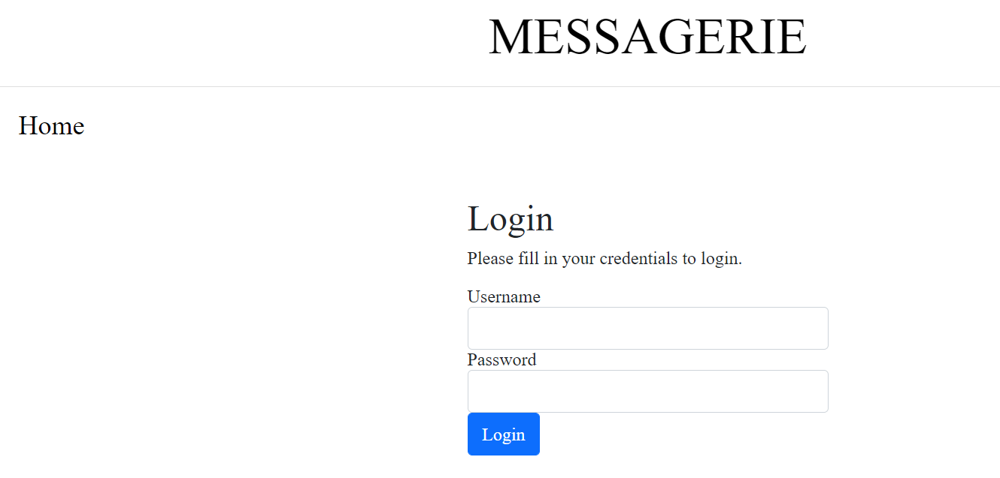
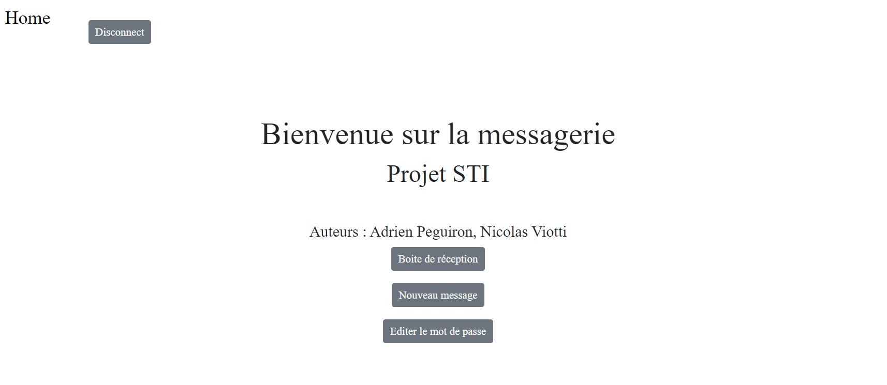
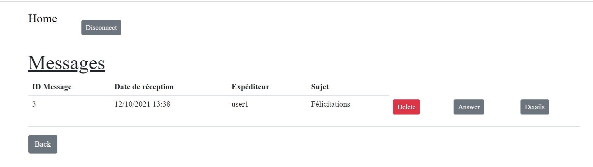
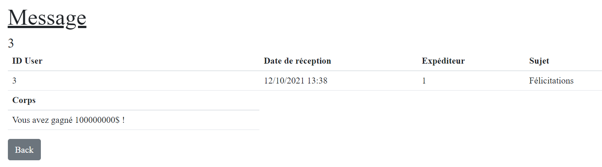
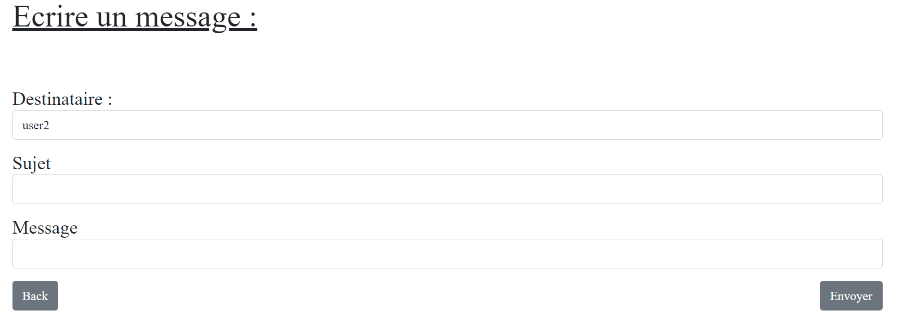
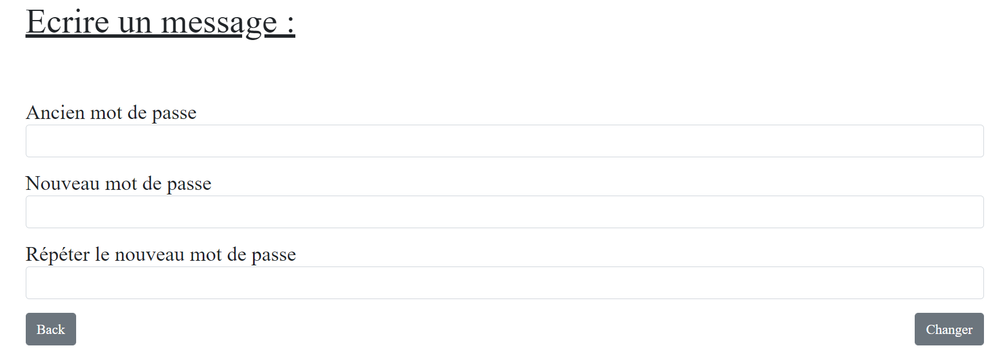
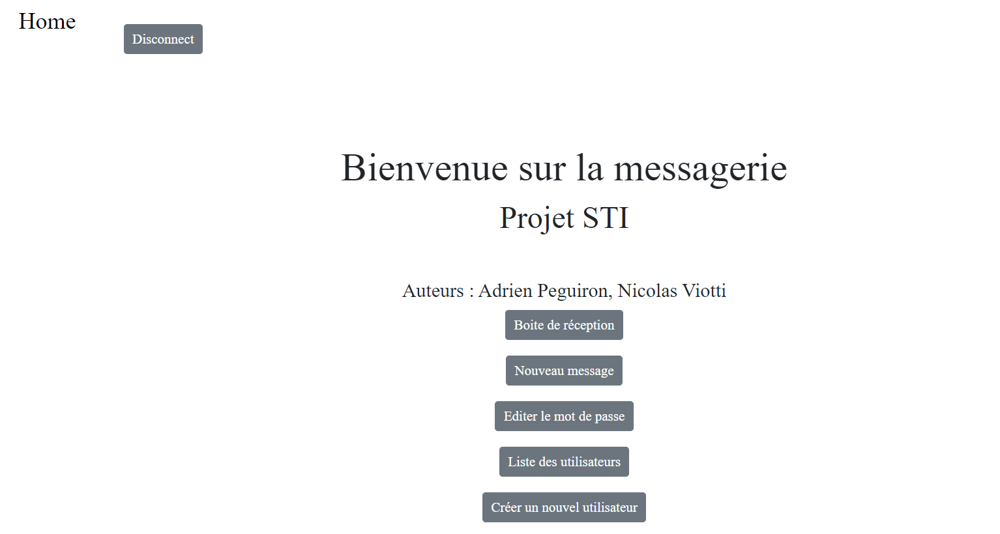
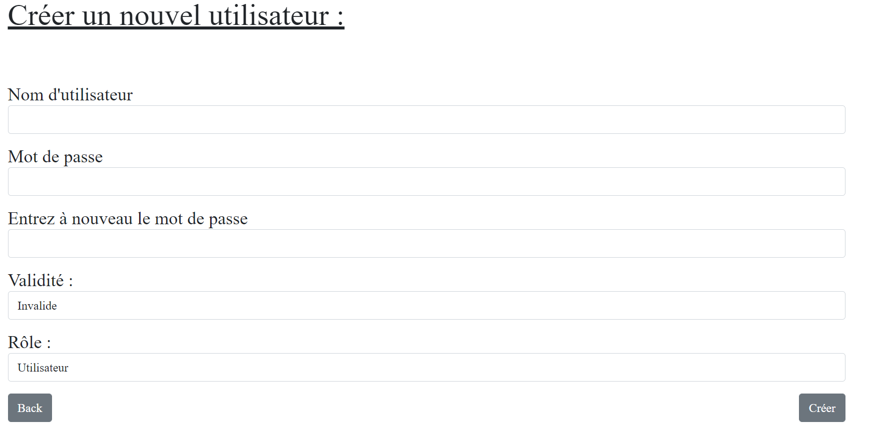
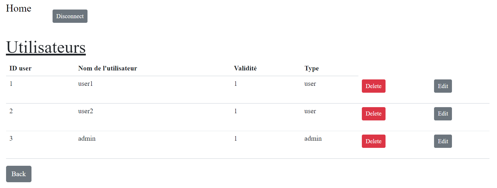
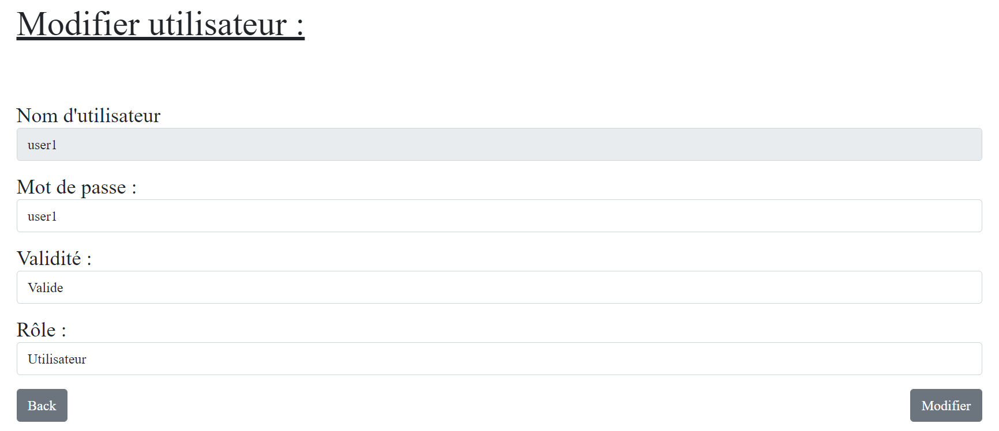

# Manuel d'utilisation

Auteurs : Peguiron Adrien, Viotti Nicolas

## Manuel utilisateur

### Général

Avant de pouvoir utiliser le site de messagerie, un administrateur doit l'avoir mis en place et vous avoir créé un compte.

Une fois cela fait, dirigez vous à l'adresse 127.0.0.1:8080 dans votre navigateur (si votre administrateur vous a donné un autre port, remplacez le 8080 par celui-ci). Vous arrivez alors sur la page de login :

 

Entrez votre nom d'utilisateur et votre mot de passe afin d'être dirigé vers la page suivante : 



Sur chaque page, vous pouvez appuyer sur le bouton `Home` en haut à gauche pour revenir à cette page.

Le bouton `Disconnect` vous permets de quitter votre compte et retourner à la page de login.

### Boîte de réception

En appuyant sur le bouton `boite de réception`, vous arrivez sur la page suivante : 



Sur cette page, vous pouvez voir les messages reçus. 

Pour supprimer un mail, cliquez sur le bouton `Delete` de sa ligne. 

Le bouton `Details` vous permets d'afficher le contenu d'un mail : 



Le contenu du message est dans le champs `Corps`

Si vous souhaitez y répondre, appuyez simplement sur le bouton `Answer` qui vous redirigera sur la page décrite au point suivant.

### Nouveau message

Depuis la page principale, le bouton `Nouveau message` vous emmène sur cette page : 



Vous pouvez ici envoyer un message au différents utilisateurs inscrits sur le site. 

Pour choisir à quel utilisateur envoyer, choisissez en un dans la liste déroulante.

Il n'est pas possible d'envoyer un message à quelqu'un qui n'a pas de compte.

Spécifiez ensuite un sujet qui donne un aperçu de votre message, puis entrez le corps de votre message dans le champs `Message`. Il ne reste plus qu'à appuyer sur `Envoyer` pour que votre message parte.

### Editer le mot de passe.

Si vous souhaitez modifier votre mot de passe, cliquez sur le bouton `Editer le mot de passe` depuis la page d'accueil.



Une fois sur cette page, entrez d'abord votre ancien mot de passe, puis entrez le nouveau et vérifiez le. Une fois le bouton `Changer` appuyé, le mot de passe est modifié.

## Manuel administrateur

### Mise en place

Pour commencer, clonez ce repo en local. Lancez ensuite la commande suivante : 

```
docker run -ti -v "$PWD/site":/usr/share/nginx/ -d -p 8080:80 --name sti_project 
--hostname sti arubinst/sti:project2018 
```

Si un service tourne déjà sur le port 8080, vous pouvez sans autre le modifier.

Cette commande permet de télécharger l’image docker nécessaire au bon fonctionnement du site, puis de lancer un container avec cette image.

Une fois le container lancé, copiez le contenu du site à l’aide des deux commandes suivantes :

```
docker cp /your/repo/site/databases/ sti_project:/usr/share/nginx
```

```
docker cp /your/repo/site/html/ sti_project:/usr/share/nginx
```

Où `/your/repo` est le chemin jusqu’au clone de votre repo.

Lancez le container en mode interactif grâce à la commande suivante : 

```
docker exec -it sti_project /bin/bash
```

Pour faire des opérations sur la base de donnée, il est nécessaire de relaxer les permissions sur celle-ci. 

Effectuez les deux commande suivantes :

```
chmod 777 /usr/share/nginx/databases
```

```
chmod 777 /usr/share/nginx/databases/database.sqlite
```

Quittez alors le mode intéractif du container avec cette commande : 

```
exit
```

Lancez ensuite les deux commandes suivantes : 

```
docker exec -u root sti_project service nginx start
```

```
docker exec -u root sti_project service php5-fpm start
```

Une fois l’exécution de ces dernières terminées, le site est accessible à l’adresse 127.0.0.1:8080 (si vous avez modifié le port, n’oubliez pas de le changer ici également.)

Vous arrivez ensuite sur la page de login suivante : 

### Manuel Administrateur

Le compte administrateur est `admin` avec comme mot de passe `admin`. 

Une fois les credentials entrés, vous arrivez sur la page principale du site : 



Un administrateur peut effectuer les mêmes opérations qu’un utilisateur lambda en plus de ses privilèges d’administrateur. Dans cette partie du manuel, seules les opérations disponibles uniquement aux administrateurs seront abordées. Si vous souhaitez vous renseigner sur celles disponibles pour tous, veuillez vous référer à la section précédente `Manuel Utilisateur`.

Les fonctionnalités des administrateurs sont les suivantes : ajouter, supprimer ou modifier un utilisateur. 

Pour ajouter un utilisateur, cliquez sur le bouton `Créer un nouvel utilisateur`. 

La page suivante s'ouvre : 



Les champ `nom d'utilisateur` et `mot de passe` sont pour les informations de connexion du nouvel utilisateur.

le champ de vérification de mot de passe permets de s'assurer que le mot de passe a bien été saisi.

Le champ `Validité` définit si l'utilisateur est valide ou non. Un utilisateur non valide existe dans le système mais il ne peut pas se connecter au site.

Et finalement le champs Rôle permet de définir si un utilisateur sera un simple collaborateur ou un administrateur. 

Une fois ces champs remplis, appuyez sur le bouton `Créer`et un nouvel utilisateur sera ajouter à la base de données.

En tant qu'administrateur, vous avez également accès à la liste des utilisateurs. Pour y accéder, sur la page principale, appuyez sur le bouton `Liste des utilisateurs`.

Vous arrivez alors sur cette page : 



Si vous souhaitez supprimer un utilisateur, appuyez simplement le bouton `Delete ` sur la ligne de l'utilisateur à enlever. 

Pour le modifier, cliquez sur `Edit`. La page suivante s'ouvre : 



Ici, vous pouvez modifier le mot de passe, la validité et le rôle d'un utilisateur. Son nom d'utilisateur n'est pas modifiable. Une fois les modifications réalisées, appuyez sur `Modifier`. Si vous souhaitez annuler, appuyez sur `Back`